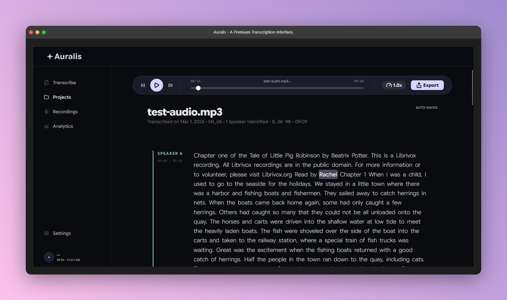
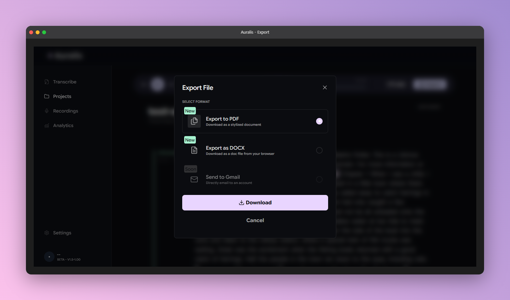

# ✦ Auralis

**Audio transcription built for people who need it done right**

[](https://auralis-beta.onrender.com)
[]()
[](https://vitejs.dev)
[](LICENSE)

**[→ Open Auralis](https://auralis-beta.onrender.com)**

---

## Overview

Auralis is a browser-based audio transcription app. Users upload a local audio file or submit a remote URL, and the server processes the transcription asynchronously via AssemblyAI with speaker diarization enabled. The client polls for job status every two seconds, validates the returned transcript, and renders it as editable, speaker-labelled utterance blocks with karaoke-style word highlighting synced to the audio player.

The app was originally built to help church staff replace manual transcription of weekly meetings and sermons. Those same staff members are the first real users of the current beta. As one of them put it: *"Transcriptions that used to take a week now take about 10 minutes to 20 including editing and upload time."*

---

## UI Preview





> Screenshots wrapped in browser mockup frames.
> Generated with [Screely](https://screely.com).

---

## Tech Stack

| Layer | Technology | Notes |
|---|---|---|
| Frontend | Vanilla JS (ES Modules), HTML5, CSS3 | No frontend framework |
| Build tool | Vite | Hot reload, ES module bundling |
| Backend | Node.js + Express | REST API, in-memory job queue |
| Transcription | AssemblyAI | Speaker diarization, language detection |
| Audio storage | IndexedDB | Persists audio blob across page refreshes |
| Transcript storage | localStorage | Session persistence, quota-aware |
| Export | jsPDF + docx.js | Client-side PDF and DOCX generation |
| Icons | Lucide (CDN) | Lightweight SVG icon set |
| Fonts | Google Fonts (Google Sans) | Loaded via CDN |
| Deployment | Render | Separate frontend and backend services |

---

## Key Features

- Polling-based transcription starts immediately after upload and resumes correctly if the page is refreshed mid-job, using a client-generated job ID persisted in localStorage.
- Speaker diarization produces labelled utterance blocks identifying each distinct speaker in the audio.
- Karaoke-style word highlighting advances through the transcript in sync with audio playback position.
- Each utterance block is independently editable in-browser, with per-utterance save state tracked separately from the global transcript.
- Keyboard shortcut support: `Ctrl`/`Cmd + S` saves the active transcript edit.
- Transcripts can be exported to PDF or DOCX directly from the browser with no server round-trip.
- The audio player supports playback speed control at 1×, 1.5×, and 2×.
- Auto-save timestamps are stored and displayed as relative time labels (e.g. "Saved 3 minutes ago"), updated on a 30-second interval.
- An onboarding flow collects a username and persists completion state to localStorage so returning users go directly to the dashboard.
- A settings panel allows language selection between English and Auto-detect, which maps to AssemblyAI's `language_detection` flag.
- The layout is mobile-responsive with a collapsible sidebar that closes on outside tap on small viewports.

---

## How Transcription Works

The client sends audio to `POST /api/upload` — either as a multipart file or a JSON body containing an `audioUrl`. Before the request leaves the client, a UUID job ID is generated client-side and included in the payload. The server registers the job immediately and responds with `{ jobId, status: "processing" }`, then continues transcription asynchronously in a detached async block. The client begins polling `GET /api/jobs/:jobId` every 2 seconds and will continue for a maximum of 5 minutes before timing out. Because the job ID was generated client-side and persisted in localStorage before the upload began, polling survives a full page refresh without data loss. When the server returns a completed transcript, it is validated client-side against confidence, word count, and speech density thresholds before being accepted and rendered. Jobs remain in the server's in-memory store until the server process restarts; a Render dyno restart will clear all in-flight jobs.

---

## Project Structure

```
auralis/
├── index.html                  # App shell, all markup
├── package.json
├── .env.example                # Required — see Getting Started
│
├── src/
│   ├── script.js               # Main entry point, UI coordination, polling logic
│   └── js/
│       ├── transcribe.js       # Upload, polling helpers, transcript validation
│       ├── audioDB.js          # IndexedDB read/write for audio blobs
│       ├── exporter.js         # PDF and DOCX export logic
│       ├── eventhub.js         # Lightweight pub/sub event bus
│       └── utils.js            # Shared utility functions
│   └── styles/
│       ├── variables.css       # CSS custom properties
│       ├── resets.css          # Base resets
│       ├── styles.css          # Core component styles
│       ├── utils.css           # Utility / helper classes
│       ├── onboarding.css      # Onboarding flow styles
│       ├── transcripts.css     # Transcript view styles
│       └── queries.css         # Media queries
│
├── server/
│   └── server.js               # Express server, /api/upload, /api/jobs/:jobId
│
└── tests/
    ├── clearAudioBlob_test.js
    ├── handleKeyDown_test.js
    ├── polling_test.js
    ├── pollingTimeout_test.js
    └── savedStateGuard_test.js
```

---

## Getting Started

### Prerequisites

- Node.js v18+
- An AssemblyAI API key (free tier available at [assemblyai.com](https://www.assemblyai.com))

### Installation

1. Clone the repository:
   ```bash
   git clone https://github.com/Jh3xy/auralis-v02.git
   cd auralis
   ```

2. Install dependencies:
   ```bash
   npm install
   ```

3. Create a `.env` file inside the `server/` directory with the following variables:
   ```env
   ASSEMBLYAI_API_KEY=your_key_here
   VITE_BACKEND_URL=http://localhost:3001
   ```

4. Start the backend server:
   ```bash
   node server/server.js
   ```

5. In a separate terminal, start the frontend dev server:
   ```bash
   npm run dev
   ```

6. Open [http://localhost:5173](http://localhost:5173) in your browser.

---

## Known Limitations

- Audio files approaching ~300 MB may cause browser tab crashes on low-RAM devices due to the IndexedDB blob storage approach, which loads the full blob into browser memory.
- The server uses an in-memory job store. A server restart or Render dyno restart clears all active jobs — in-flight transcription jobs will not recover.
- URL-based upload retry after a page refresh is not yet fully implemented. Users may need to re-submit the URL manually if the page is refreshed before polling completes.
- The Recordings, Templates, and Analytics sections in the sidebar are UI placeholders and are not yet functional.
- Render free tier deployments spin down after a period of inactivity. The first request after a cold start may take 30–60 seconds to respond.

---

## What I Would Do Differently

If I were starting this project from scratch, the first thing I would change is how I approached planning. The project began as a small internal utility and evolved into a production attempt mid-build, which created architectural debt that had to be identified and refactored under real deadline pressure. Defining scope and target quality level before writing a single line of code would have saved significant rework.

I would also reduce my reliance on AI-generated code for core architecture decisions. The patterns introduced were often correct in isolation, but they created edge cases at integration boundaries that took significant debugging to resolve. Working through those problems was a valuable learning experience, but understanding the patterns deeply enough to fix them was forced rather than intentional — that is not a sound way to build something you intend to maintain.

Finally, I would design the audio persistence layer differently from the start. The current IndexedDB blob approach places the full audio file into browser memory on each restore, which creates RAM pressure on low-memory devices at scale. A streaming or server-side audio reference approach would be more appropriate for a production system handling large files.

---

## Roadmap

- [x] Polling-based transcription with job resume on page refresh
- [x] Speaker diarization and per-utterance editing
- [x] PDF and DOCX export
- [x] Production hardening (error tolerance, polling timeouts, memory management)
- [ ] Replace IndexedDB blob storage with a streaming audio reference to reduce RAM usage
- [ ] URL upload retry persistence after page refresh
- [ ] Recordings section — searchable transcript history
- [ ] Multi-file batch transcription
- [ ] User authentication and cloud transcript storage
- [ ] Native mobile app (long-term)

---

## Contributing

The project is in active development, with a backend contributor currently onboarding. Issues and pull requests are welcome. Please branch from `main` and follow the existing commit message format used in the repository. Note that Issue 5 (saveAudioBlob silent failure on IndexedDB write) and Issue 6 (URL uploadData persistence after page refresh) are known deferred items awaiting backend infrastructure work and should not be addressed in isolation without that context.

---

## License

MIT License

